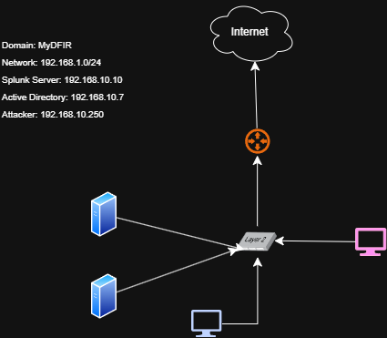

# Home-Lab
Active Directory Project with Splunk

# My Home Lab Documentation

This repository documents the architecture, hardware, and configurations of my personal home lab environment.

## 🌐 Network Diagram
Below is the visual layout of my network architecture:

## 🖥️ Hardware Specifications
* **Host 1 (Primary Server):** Mini PC / Custom Build
  * **CPU:** Intel/AMD Info
  * **RAM:** 32GB DDR4
  * **Storage:** 1TB NVMe SSD
  * **OS/Hypervisor:** Proxmox VE / TrueNAS / Ubuntu Server

## ⚙️ Services & Applications
* **Network Infrastructure:** Pi-hole (DNS/Ad-blocking), PfSense (Firewall)
* **Automation & Tools:** Home Assistant
* **Media & Storage:** Plex / Jellyfin

## 🔒 Security & Access
* **Remote Access:** Tailscale VPN
* **Reverse Proxy:** Nginx Proxy Manager
